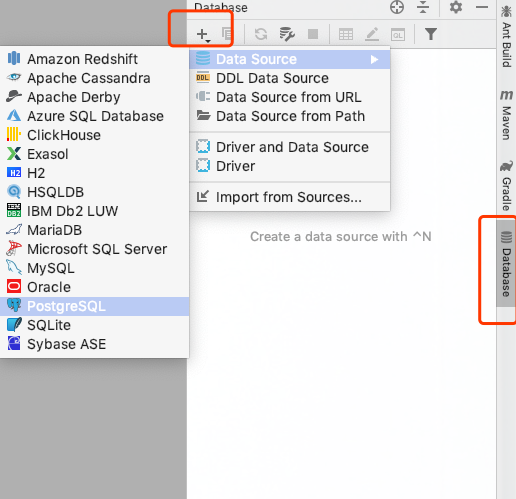
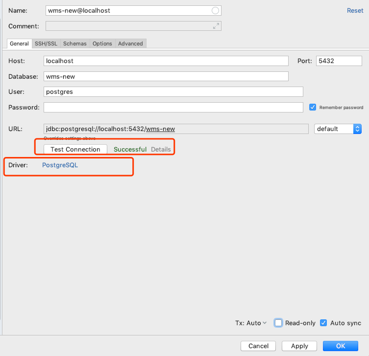
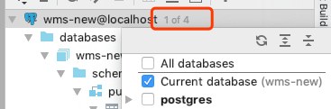
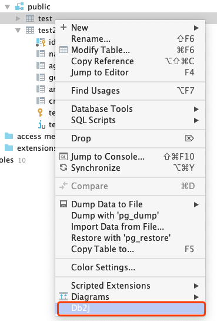
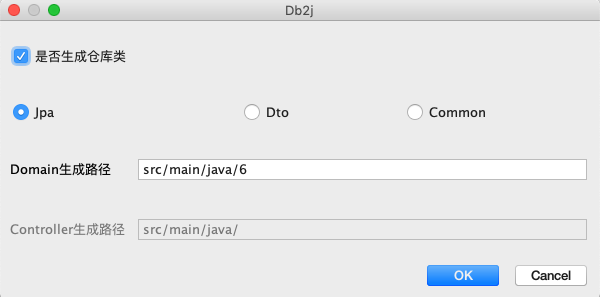

# Db2j idea plugin
[中文](README_CN.md)

Features：use in database tool, select database tables to generate java files. includes: domain、repository、controller.
Idea Version：Ultimate 2019.1+
[Plugin url](https://plugins.jetbrains.com/plugin/11965-db2j)

# Plugin Installation：
- Marketplace:
  - <kbd>Preferences</kbd> > <kbd>Plugins</kbd> > <kbd>Marketplace</kbd> > <kbd>Search for "db2j"</kbd> > <kbd>Install Plugin</kbd>
- Manual:
  - Download the [zip](https://github.com/SShnoodles/db2j-idea-plugin/releases) and install it manually using <kbd>Preferences</kbd> > <kbd>Plugins</kbd> > <kbd>Install plugin from disk...</kbd>

# Quick Start

# Update log
1.1.1 Ultimate 2019.1+
* Fixed Do class name
* Modified NewXXData -> XXNew

1.1.0 Ultimate 2019.1+
* Support single table rename
* Refactor file names, like XXForm -> NewXXData or XXUpdate; XXRef -> XXRecord

1.0.9 Ultimate 2019.1+
* Support overwrite files Selection 

1.0.8 Ultimate 2019.1+
* Fixed put function path params
* Added some comments
  
1.0.7 Ultimate 2019.1+
* Update to sdk 2019.1
* Added author

1.0.6 Ultimate 2018.3+
* Added package

1.0.5 Ultimate 2018.3+
* Added controller template
* Ref、Criteria、Dto、Form at the same time
  
1.0.4 Ultimate 2018.3+
* Fixed repository primaryKey type
* Support Repository class

1.0.3 Ultimate 2018.3+
* Support entity class

# Using screenshots：
### 1、Add Database

### 2、Config db

### 3、Select the tables and right-click the display menu

### 4、Ok

* Repository Interface: default Domain Path
* Controller:
  * {Controller Path} Controller、`DataMapper(updater)`、`Updater(updater)`
  * {Controller Path}/data `Ref、Form、Dto、Criteria`
* Overwrite Files: default false
* Template: `Jpa、Dto、Common`
  * Jpa `javax.persistence`
  * Dto `public`
  * Common `private`
* Domain Path:
  * Single Module：`src/main/java/cc/ssnoodles/demo/domain`
  * Multiple Modules：`base/src/main/java/cc/ssnoodles/demo/base/domain`
* Controller Path:
  * Single Module：`src/main/java/cc/ssnoodles/demo/api`
  * Multiple Modules：`base/src/main/java/cc/ssnoodles/demo/base/api`
* Single rename: Single table support rename class and interface, default table hump name.

# Introduced projects
* [db2j](https://github.com/SShnoodles/database2javafiles)
* [lombok](https://www.projectlombok.org)

# Reference projects
* [plugin doc](http://www.jetbrains.org/intellij/sdk/docs/tutorials/build_system/prerequisites.html)
* [better-mybatis-generator](https://github.com/kmaster/better-mybatis-generator)

# Development
gradle.properties

ideaSDKlocalPath=

# other
[PredicateUtils](code.md)

