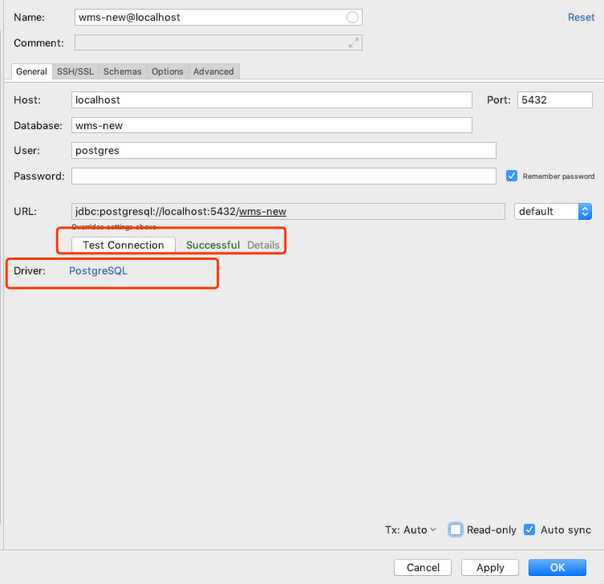
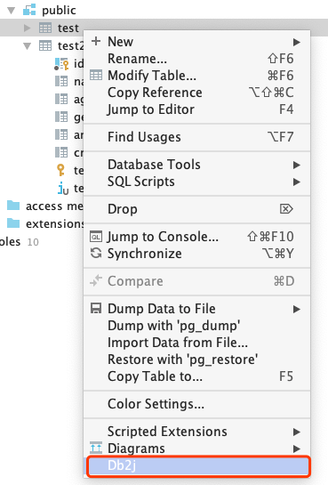

# 简介
插件功能：在idea的database工具中使用，选择表（可多张），生成相关的代码。包括: domain、repository、controller。
Idea版本：Ultimate 2019.1+
[插件地址](https://plugins.jetbrains.com/plugin/11965-db2j)

# 插件安装：
- 在idea插件系统里安装:
  - <kbd>Preferences</kbd> > <kbd>Plugins</kbd> > <kbd>Marketplace</kbd> > <kbd>Search for "db2j"</kbd> > <kbd>Install Plugin</kbd>
- 手动zip安装:
  - 下载 [zip](https://github.com/SShnoodles/db2j-idea-plugin/releases) and install it manually using <kbd>Preferences</kbd> > <kbd>Plugins</kbd> > <kbd>Install plugin from disk...</kbd>

# 快速入门

# 更新日志
1.1.1 Ultimate 2019.1+
* 修复Do的类名
* 修改NewXXData -> XXNew

1.1.0 Ultimate 2019.1+
* 支持单表的重命名
* 重构一些类名，比如 XXForm -> NewXXData or XXUpdate; XXRef -> XXRecord

1.0.9 Ultimate 2019.1+
* 支持是否覆盖文件选择

1.0.8 Ultimate 2019.1+
* 修复put方法缺少参数问题
* 添加一些方法参数注释
  
1.0.7 Ultimate 2019.1+
* 支持作者名

1.0.6 Ultimate 2018.3+
* 添加package 包名生成

1.0.5 Ultimate 2018.3+
* 支持Controller模板生成
* 生成Controlelr的同时生成Ref、Criteria、Dto、Form
  
1.0.4 Ultimate 2018.3+
* 支持仓库接口生成

1.0.3 Ultimate 2018.3+
* 支持实体类生成

# 使用截图：
### 1、添加Database

### 2、配置数据库，显示表空间。

### 3、在需要生成代码的表上右键，选择Db2j，打开预览界面。

### 4、设置确认完成后，点击ok，开始生成代码。

* Repository Interface: 仓库接口默认生成在Domain Path下
* Controller: 此类生成在Controller Path下，其他随之生成的类默认在data下
  * {Controller Path}下生成Controller、`DataMapper(存在则追加)`、`Updater(存在则追加)`
  * {Controller Path}/data下生成`Ref、Form、Dto、Criteria`
* Overwrite Files: 是否覆盖已有文件，默认false（不对DataMapper、Updater生效）。
* 模板: `Jpa、Dto、Common` 3种
  * Jpa 为带`javax.persistence`下相关注解的
  * Dto 为`public`字段
  * Common 为`private`字段
* Domain Path: 数据库模型生成路径(正反斜杠都支持)
  * 单模块例子：`src/main/java/cc/ssnoodles/demo/domain`
  * 多模块例子：`base/src/main/java/cc/ssnoodles/demo/base/domain`
* Controller Path: Controller类生成路径(正反斜杠都支持)
  * 单模块例子：`src/main/java/cc/ssnoodles/demo/api`
  * 多模块base模块例子：`base/src/main/java/cc/ssnoodles/demo/base/api`
* Single rename: 单表支持重命名生成后的类和接口，默认表名驼峰格式。
  
# 依赖项目
* [db2j](https://github.com/SShnoodles/database2javafiles)
* [lombok](https://www.projectlombok.org)

# 参考文档和项目
* [plugin doc](http://www.jetbrains.org/intellij/sdk/docs/tutorials/build_system/prerequisites.html)
* [better-mybatis-generator](https://github.com/kmaster/better-mybatis-generator)

# 开发
gradle.properties

ideaSDKlocalPath=本地IDEA路径

# 其他
[PredicateUtils](code.md)